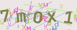
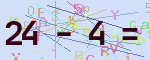
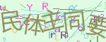
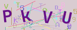
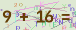
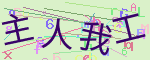

## 概述

php验证码类，支持字母数字 、 运算符、中文验证码 

字体：中文摘取常用100汉字和字母数字+运算符精简后的字体 

未开启Imagick拓展时，动态图会变为静态图

    

   


## 安装


```shell
composer require aknife/captcha
```

## 快速入门

示例代码

```php

use Aknife\captcha;

// 验证码配置
$config = [
    'type'      => 1, // 验证码类型(默认1) [1-字母数字, 2-算术, 3-中文]
    'width'     => 150, // 图片宽度(必填)
    'height'    => 80, // 图片高度(必填)
    'length'    => 4, // 验证码位数(默认5)
    'fontSize'  => 25, // 字体大小(默认25)
    'gif'       => 30, // 使用动图(默认30) [0-不启用,其他大于0的数字为gif帧速度]
    'uppercase' => 0, // 区分大小写(默认0) [0不区分，1区分]
    'session'   => 'demo' // session key $_SESSION['demo']['captcha']
];
// 输出图片
Captcha::create($config);

// 验证验证码
Captcha::check('验证码字符','demo');

```
